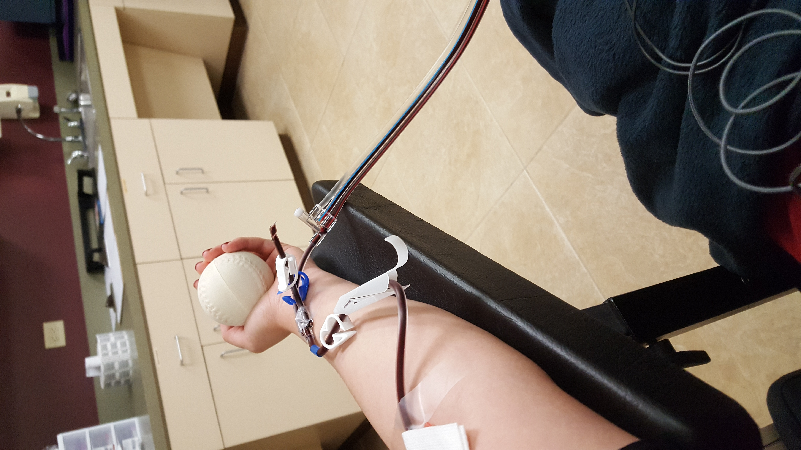
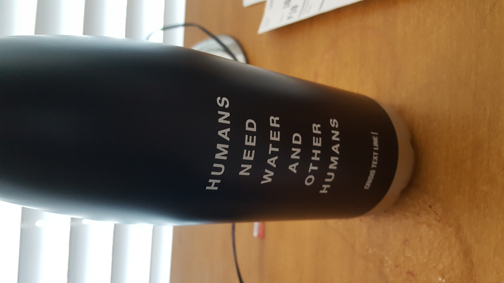
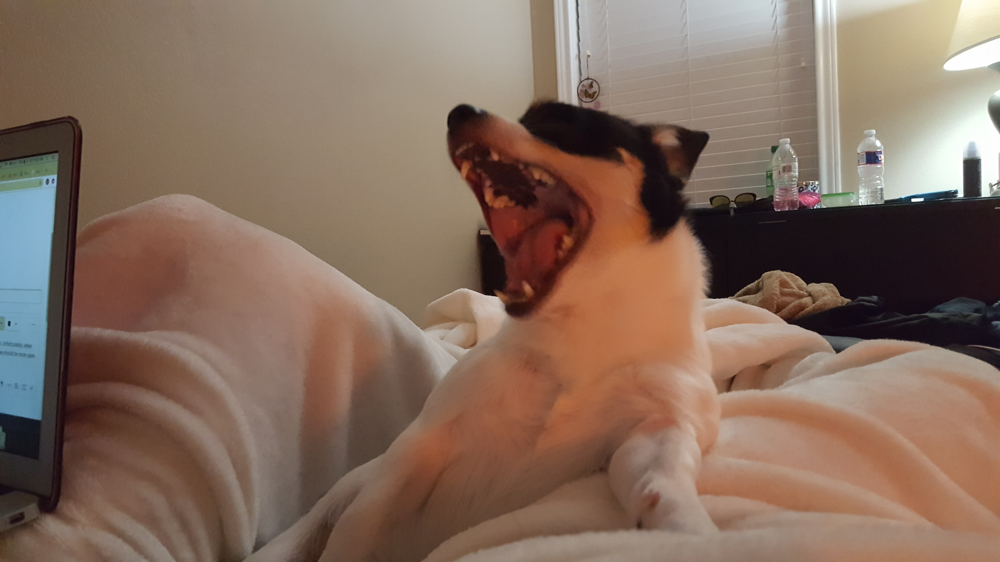

This page is about me!

. Whenever I am eligible to donate again, I set up an appointment with the Gulf Coast Regional Blood Center. It is important for me to do so because I think it is a great way to give back to the community and help those who need blood or certain blood components. I would recommend getting some calcium in your body before donating platelets to avoid the tingly sensation in the lips!

. I got this bottle while volunteering with Crisis Text Line. After going through a few of my own tough times, I wanted to reach out and help others in their own time of need. It was extremely tough work mentally, but I am glad I could make a difference in other people's lives.

. This is my dog Yuuki! He is a needy, little mutt, but I love him nonetheless. I adopted this little creature and now he has been thoroughly and completely spoiled. He must sleep on the bed and on my pillows, and he absolutely requires air conditioning. He is picky about his toothpaste, his food, and especially with his treats. He must have Gerber Chicken Baby Food ever since he went to the veterinarian. 
